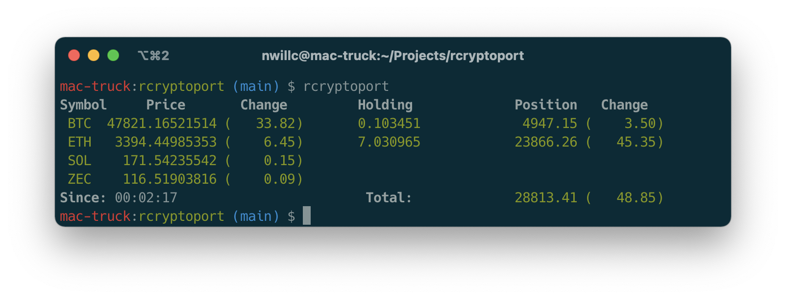

[](https://github.com/nwillc/rcryptoport/actions/workflows/CI.yml)
---
# rcryptoport

A command line crypto-currency portfolio status application implemented in Rust. Uses [Nomics](https://p.nomics.com/cryptocurrency-bitcoin-api) free API.



## Command Line Options
```shell
$ rcryptoport -h
rcryptoport 2.0.0
nwillc@gmail.com
Retrieve current value of your crypto portfolio.

USAGE:
    rcryptoport [FLAGS] [OPTIONS] [SUBCOMMAND]

FLAGS:
    -d, --dry-run    Dry run, do not save values
    -h, --help       Prints help information
    -V, --version    Prints version information

OPTIONS:
    -c, --config <FILE>     Path to specific config file
    -l, --loop <SECONDS>    Run looping every SECONDS seconds

SUBCOMMANDS:
    help     Prints this message or the help of the given subcommand(s)
    setup    Set up portfolio configuration
```
## Configuration
Have your Nomics API key and holdings info ready. Setup your configuration:

```shell
$ rcryptoport setup
```

## TODO

- Add timestamp to config and note time elapsed since last run in output.
